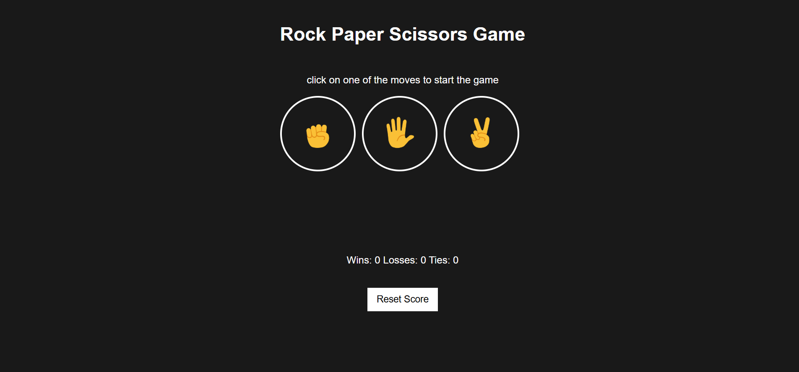
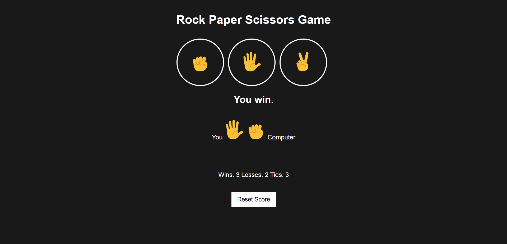

## 🎮 Rock Paper Scissors Game
A simple Rock Paper Scissors game built using HTML, CSS, and JavaScript. Play against the computer and track your score!

## 🚀 Features
✅ User vs. Computer Gameplay
✅ Random Computer Move Selection
✅ Live Score Tracking (Stored in localStorage)
✅ Reset Score Button
✅ Responsive Design

## 📸 Screenshot

## 🛠️ Technologies Used
HTML – For the game structure
CSS – For styling the UI
JavaScript – For game logic

## 🔧 How to Run the Game
-> Clone the Repository:
git clone https://github.com/your-username/rock-paper-scissors.git
cd rock-paper-scissors
-> Open index.html in a Browser
Open the file in Chrome, Firefox, or any browser.

## 🎮 How to Play
~ Click on Rock, Paper, or Scissors to make your move.
~ The computer will randomly choose its move.
~ The result will be displayed: Win, Lose, or Tie.
~ Your score will be updated and saved.
~ Click Reset Score to clear your progress.

## 📌 Future Enhancements
🎨 Better UI with animations
🔊 Sound effects
🤖 AI-powered difficulty levels.

## 👨‍💻 Author
Zarlish Fathima ✨
